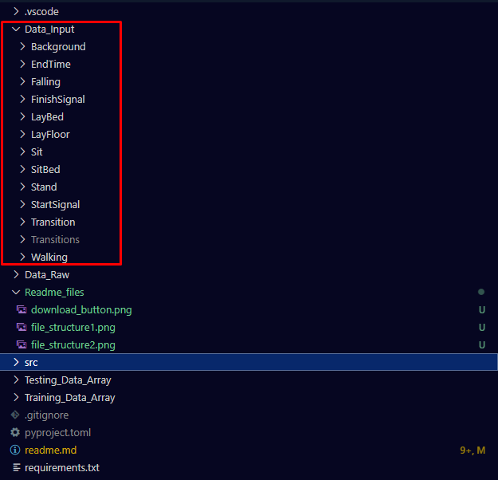

# mmWave Model Setup
## This guide will help setup the following
1. [Running Data Processing](#markdown-header-1-running-data-processing)
2. [Setting up Katana](#markdown-header-2-setting-up-katana) 
3. [Setting up OneDrive to work with Katana](#markdown-header-3-setting-up-onedrive-to-work-with-katana)
4. [Running the model](#markdown-header-4-running-the-model)

## 1. Running Data Processing 
To begin data processing first you will need to download the data set from one drive in the teams. This should be stored in a folder at the root of the directory called "Data_Raw". This can be seen in the image below: 


Once downloaded you should have your file structure looking like the following: 


Next you want to navigate to the folder: "src/preprocessing" and find the file "ADL.py". Run the python script to then have the following folder added to the repository structure (you should gitignore these files). The following image shows where to find the script and what the expected file structure will be after running the script: 


If done correctly the Data Input folder should look as the following: 



Step 1 is now complete

## 2. Setting up Katana

### All the steps here will assume you are ssh'ing into katana in some form. 
This step assumes you have a katana account already, if not you can request an account by following this link [here](https://research.unsw.edu.au/katana). Once you have a katana account, you can begin to setup a virtual environment for running code related to this project. First ssh into katana through the use of any terminal. Once in katana run the following commands
```
> git clone https://abanobT@bitbucket.org/gsbme/data_analysis_mmwave.git  
> mkdir ~/.venvs
> module load python/3.7.4
> python3 -m venv ~/.venvs/mmWave
> source ~/.venvs/mmWave/bin/activate
> cd ~/data_analysis_mmWave
> python3 -m pip install --upgrade pip
> python3 -m pip install -r requirements.txt
```

Now we will use Katana ondemand for all our coding purposes, to do this we need to download cisco vpn [here](https://www.myit.unsw.edu.au/services/students/remote-access-vpn) and choose the method for installation based on your operating system. Once downloaded connect to vpn.unsw.edu.au and enter your zid and zpass to connect to unsw vpn.

After being connected to unsw vpn open the following webpage on the browser to access katana on demand [here](https://kod.restech.unsw.edu.au/pun/sys/dashboard). Once in you can launch the notebook by requesting an interactive session for jupyter notebook. Once assigned your session, choose the kernel as the environment you have made in the previous commands, and you will be ready to run code in the notebook in step 4. 

## 3. Setting up OneDrive to work with Katana

### All steps here assume you are ssh'd into katana and working remotely

Before beginning make sure you email [itu services](itservicecentre@unsw.edu.au) and in the subject line enter "Katana onedrive secret key." in the email body simply ask for the secret key to mount onedrive using rclone.

Also give consent from onedrive to allow rclone to access your files following this link [here](https://consenthelper.it.unsw.edu.au/consent?appId=c8800f43-7805-46c2-b8b2-1c55f3859a4c)

since we are working remote to mount OneDrive onto katana we also need rclone working locally, so setup rclone locally similarly to how you will do it on katana in the following steps, this is very important to do.

### Add your bin folder to the path on katana. Use either gedit/vim/nano to edit .bashrc in the home directory of katana
        
```
> vim .bashrc
```
insert the following red underlined lines of code into .bashrc exactly, and MAKE SURE YOU CHANGE YOUR ZID TO MATCH YOUR OWN ONE DO NOT USE MINE


### Restart your shell to have this go into effect

```
> exit
> ssh zid@katana.restech.unsw.edu.au
```

### install rclone

```
> wget https://downloads.rclone.org/v1.55.0/rclone-v1.55.0-linux-amd64.zip
> unzip rclone-v1.55.0-linux-amd64.zip
> cp rclone-v1.55.0-linux-amd64/rclone ~/bin/
```

### Configure rclone for onedrive 

```
> rclone config
> n
> OneDrive
> 26
> c8800f43-7805-46c2-b8b2-1c55f3859a4c
> paste secret key here
> 1
> N
> y
> repeat all above steps locally 
> copy and paste the command they give you into the browser
```


after approving, copy the result from doing this locally 
paste the code return that you just copied
```
> 1
> 0
> Y
> rclone mount OneDrive: /home/zid/OneDrive --daemon --vfs-cache-mode writes --allow-non-empty
```

Hooray now OneDrive is now mounted onto katana. Note you should unmount OneDrive when you are done everytime using this command

```
> fusermount -u /home/z5075490/OneDrive
```

## 4. Running the model
Now that everything is setup to run correctly, create a jupyter lab instance on katana ondemand and request 1-2 hours with 16 cores (64gb of ram). Select the kernel that matches the environment you setup in step 1. Now simply open the notebook and run each cell and hooray!!! 